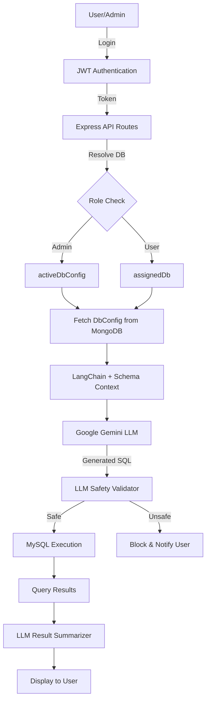

# NL2SQL — GenAI Powered Natural Language to SQL Agent


A full-stack AI-powered system that allows users to interact with SQL databases using natural language instead of writing queries manually. The system uses **Google Gemini** via **LangChain** to generate, validate, and explain SQL queries securely with multi-database support and role-based access control.

---

## 🚀 Features

### 🤖 AI-Powered Querying
- Convert natural language questions into SQL queries using **Google Gemini LLM**.
- Schema-aware query generation with automatic database context injection.
- AI-generated explanations for query results in plain English.

### ✅ Three-Layer Query Safety System
- **LLM-based SQL validation** blocks unsafe queries before execution.
- Prevents destructive operations: `DROP`, `TRUNCATE`, `ALTER`, `CREATE`.
- Enforces `WHERE` clauses in `UPDATE` and `DELETE` statements.
- Real-time safety feedback displayed to users.

### 🧑‍💼 Role-Based Access Control
- **Admin**
  - Create and deactivate users with assigned databases.
  - Register multiple database connections dynamically.
  - Switch between databases in real-time via dropdown selector.
  - Manage database configurations and user permissions.
- **User**
  - Access only their assigned database.
  - Cannot view or modify database configurations.
  - Query interface with AI-powered assistance.

### 🗄️ Dynamic Multi-Database Support
- Connect multiple MySQL databases without code changes.
- Automatic schema introspection using `SHOW TABLES` and `DESCRIBE`.
- Schema summaries cached in MongoDB for optimized LLM context.
- Admin can toggle between databases; users restricted to assigned DB.
- Fresh database config fetched on every query for accuracy.

### 🔐 Enterprise-Grade Security
- **JWT-based authentication** with bcrypt password hashing.
- **AES-256-CBC encryption** for database credentials at rest.
- **Zod schema validation** for all API inputs.
- Custom middleware for route protection and role enforcement.
- Encrypted password storage with pre-save hooks in Mongoose.

### 📊 Intelligent Query Results
- Results displayed in responsive, gradient-styled tables.
- AI-powered summaries explain query output in business terms.
- Real-time validation feedback with color-coded indicators.
- Database context shown during query execution.

---

## 🏗️ Architecture Overview


---

## 📂 Project Structure
```
mini-project/
│
├── frontend/                    # Frontend UI
│   ├── index.html              # Main query interface
│   ├── landing.html            # Landing page
│   ├── signin.html             # Login page
│   ├── admin.html              # User management
│   ├── admin-database.html     # Database configuration
│   ├── style.css               # Gradient-themed styling
│   ├── script.js               # Main app logic
│   ├── script-admin-user.js    # User management logic
│   └── script-admin-db.js      # DB configuration logic
│
└── nl2sql-agent/               # Backend API
    ├── server.js               # Express server entry point
    ├── package.json            # Dependencies
    ├── .env                    # Environment variables (not in repo)
    │
    ├── middleware/
    │   └── auth.js             # JWT authentication & role checks
    │
    ├── models/
    │   ├── User.js             # User schema (MongoDB)
    │   └── DbConfig.js         # Database config schema
    │
    ├── routes/
    │   ├── authRoutes.js       # Login, create user, deactivate
    │   ├── dbRoutes.js         # DB connection, schema fetch, toggle
    │   └── queryRoutes.js      # Generate, validate, execute SQL
    │
    └── services/
        ├── authService.js      # JWT sign/verify
        ├── dbManager.js        # MySQL connection pooling
        ├── langchainService.js # LLM integration (Gemini)
        └── dbService.js        # Query execution wrapper
```

---

## ⚙️ Tech Stack

| Component | Technology |
|:----------|:-----------|
| **Backend** | Node.js, Express.js |
| **Databases** | MongoDB (configs/users), MySQL (query execution) |
| **AI/LLM** | Google Gemini 2.5 Flash via LangChain |
| **Authentication** | JWT (jsonwebtoken), bcrypt |
| **Validation** | Zod |
| **Security** | AES-256-CBC encryption (crypto) |
| **ORM** | Mongoose (MongoDB), mysql2 (MySQL) |
| **Frontend** | HTML5, CSS3 (Gradient UI), Vanilla JavaScript |
| **API Design** | RESTful APIs with modular routing |

---

## ▶️ Setup Instructions

### 1. Clone Repository
```bash
git clone https://github.com/alokkcode/nl2sql.git
cd nl2sql/nl2sql-agent
```

### 2. Install Dependencies
```bash
npm install
```

### 3. Environment Setup

Create a `.env` file in `nl2sql-agent/` directory:
```env
# Server Configuration
PORT=5000

# MongoDB Connection
MONGO_URI=mongodb://localhost:27017/nl2sql

# Google Gemini API
GEMINI_API_KEY=your_gemini_api_key_here

# JWT Secret
JWT_SECRET=your_secret_key_here

# Admin Credentials (Auto-seeded on first run)
ADMIN_EMAIL=admin@example.com
ADMIN_PASSWORD=admin123

# Database Encryption Keys (32 chars for key, 16 for IV)
DB_ENC_KEY=12345678901234567890123456789012
DB_ENC_IV=1234567890123456
```

**Get Gemini API Key:**
Visit [Google AI Studio](https://makersuite.google.com/app/apikey) to generate your free API key.

### 4. Start MongoDB

Ensure MongoDB is running locally:
```bash
mongod
```

Or use MongoDB Atlas cloud connection string in `MONGO_URI`.

### 5. Run Server
```bash
npm start
```

Server will start at: `http://localhost:5000`

Admin will be auto-seeded on first run.

### 6. Open Frontend

Use **Live Server** extension in VS Code or open `frontend/landing.html` directly in browser.

---

## 👤 Usage Flow

### Admin Workflow

1. **Login** with seeded credentials (`admin@example.com` / `admin123`)
2. **Add Database** via "DB Config" button:
   - Enter MySQL credentials (host, user, password, database)
   - System automatically extracts schema
   - Credentials encrypted and stored in MongoDB
3. **Create Users** via "Manage Users" button:
   - Provide email, password, role
   - Assign database to regular users
   - Admins don't need database assignment
4. **Switch Databases** using dropdown selector in header:
   - Dynamically toggle between connected databases
   - Next query uses selected database's schema
5. **Query Database** using natural language:
   - Ask questions like "show total sales by category"
   - Review generated SQL
   - Execute after validation

### User Workflow

1. **Login** with credentials provided by admin
2. **Query Database** (only assigned database accessible):
   - Type natural language questions
   - System generates SQL using assigned DB schema
   - View results in table format with AI summary
3. **No admin features visible** (no DB switcher, no user management)

---

## 🔐 Security Implementation

### Authentication Layer
```javascript
// JWT-based authentication
requireAuth middleware → Validates token → Loads user with populated DB refs

// Role-based authorization
requireAdmin middleware → Blocks non-admin routes
```

### Password Security
```javascript
// User passwords: bcrypt hashing (10 rounds)
passwordHash = await bcrypt.hash(password, 10);

// DB credentials: AES-256-CBC encryption
password = encrypt(plainPassword); // Stored encrypted
realPassword = dbConfig.getDecryptedPassword(); // Decrypted at runtime
```

### Input Validation
```javascript
// All API inputs validated with Zod schemas
const loginSchema = z.object({
  email: z.string().email(),
  password: z.string().min(6)
});
```

### SQL Safety
```javascript
// Three-layer protection:
1. LLM validates SQL before execution
2. Blocks: DROP, ALTER, TRUNCATE, CREATE
3. Requires WHERE in UPDATE/DELETE
```

---


## 📄 License

This project is licensed under the MIT License - see the [LICENSE](LICENSE) file for details.

---

## 👨‍💻 Author

**Alok Kumar**

- GitHub: [@alokkcode](https://github.com/alokkcode)
---

## 🙏 Acknowledgments

- Google Gemini for powerful LLM capabilities
- LangChain for LLM abstraction layer
- MongoDB for flexible schema storage
- Express.js community for excellent middleware ecosystem

---


**Built with ❤️ using GenAI and Modern Web Technologies**
